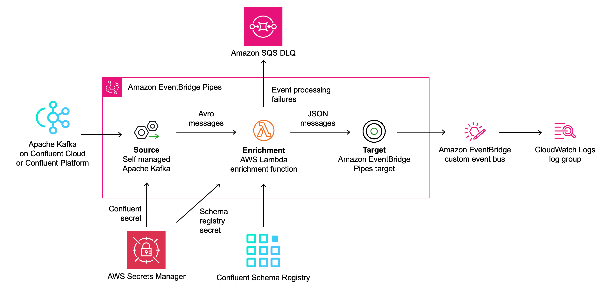

# Event schema validation for Apache Kafka with EventBridge Pipes and Confluent Schema Registry

This code sample allows you to perform event schema validation and conversion from Avro to JSON for events read by [Amazon EventBridge Pipes](https://docs.aws.amazon.com/eventbridge/latest/userguide/eb-pipes.html) from an Apache Kafka stream using [Confluent Schema Registry](https://gitlab.aws.dev/pbv/pipes-schema-validation). Using EventBridge Pipe's [self managed Apache Kafka source](https://docs.aws.amazon.com/eventbridge/latest/userguide/eb-pipes-kafka.html), you can read events from any Apache Kafka stream. This repository shows how to set up event schema validation for a Kafka stream running on [Confluent Cloud](https://www.confluent.io/confluent-cloud/) or [Confluent Platform](https://docs.confluent.io/platform/current/platform.html).

In this example implementation, events are read from Kafka using EventBridge Pipes and published to an [EventBridge event bus](https://docs.aws.amazon.com/eventbridge/latest/userguide/eb-event-bus.html) which logs all incoming events to a [CloudWatch Logs log group](https://docs.aws.amazon.com/AmazonCloudWatch/latest/logs/Working-with-log-groups-and-streams.html). Customize the [target of EventBridge Pipes](https://docs.aws.amazon.com/eventbridge/latest/userguide/eb-pipes-event-target.html) or the [EventBridge event bus target](https://docs.aws.amazon.com/eventbridge/latest/userguide/eb-targets.html) to suit your use case.

See the associated blog post on the AWS Compute Blog: https://aws.amazon.com/blogs/compute/converting-apache-kafka-events-from-avro-to-json-using-eventbridge-pipes/

> This architecture will create resources that will incur costs. Please refer to the [AWS Pricing](https://aws.amazon.com/pricing/) page for details and ensure you understand the costs before deploying this stack. This application was written for demonstration and education purposes and not for production use. Take a look at the [Security](#security) section of this readme and consider consulting your security team before deploying this stack. No warranty is implied in this example.

## Prerequisites

- [Create an AWS account](https://portal.aws.amazon.com/gp/aws/developer/registration/index.html) if you do not already have one and log in. The IAM user that you use must have sufficient permissions to make necessary AWS service calls and manage AWS resources
- [AWS CLI](https://docs.aws.amazon.com/cli/latest/userguide/install-cliv2.html) installed and configured
- [Git](https://git-scm.com/book/en/v2/Getting-Started-Installing-Git) installed
- [AWS Cloud Development Kit (AWS CDK)](https://aws.amazon.com/cdk/) installed
- [Confluent Cloud](https://www.confluent.io/confluent-cloud/) or [Confluent Platform](https://docs.confluent.io/platform/current/platform.html) Kafka cluster with [Confluent Schema Registry](https://docs.confluent.io/platform/current/schema-registry/index.html) set up

## Deployment instructions

### Create Confluent secrets

To deploy this CDK stack, you need two sets of credentials. A first one for accessing the Kafka cluster running in Confluent Cloud and a second one for accessing the Confluent Schema Registry running in Confluent Cloud which uses its own set of credentials:

1. Store your Confluent Cloud secret in AWS Secrets Manager in the AWS Region you want to set up the EventBridge pipe. This secret is used by the EventBridge Pipe to authenticate with Confluent Cloud. Take note of the ARN of this secret as you will need it later in the deployment.

   Make sure the plaintext secret matches the following format:

   ```json
   {
     "username": "ENXHJIHVVAFI4PCP",
     "password": "sMjr6/7dAp/tzrX2EfQXQjpVFit1N2/cNhHa6XkGaFXXVxz1HaR+pQ3n+wsYeWfd"
   }
   ```

   For Confluent Cloud, the `username` and `password` correspond to API `Key` and `Secret` respectively. See [API Keys to Control Access in Confluent Cloud](https://docs.confluent.io/cloud/current/access-management/authenticate/api-keys/api-keys.html) for details.

   See the [EventBridge Pipes User Guide](https://docs.aws.amazon.com/eventbridge/latest/userguide/eb-pipes-kafka.html) for more authentication options.

1. Create a second secret for the Confluent Cloud Schema Registry endpoint and API key in the AWS Region you want to set up the EventBridge pipe. This secret is used by the enrichment Lambda function to authenticate with the Confluent Schema Registry. Take note of the secret name of this secret as you will need it later in the deployment.

   Make sure the plaintext secret matches the following format:

   ```json
   {
     "url": "https://<endpoint>.<region>.aws.confluent.cloud",
     "basic.auth.user.info": "<your key>:<your secret>"
   }
   ```

   For example:

   ```json
   {
     "url": "https://dsgc-yk9ny.us-east-2.aws.confluent.cloud",
     "basic.auth.user.info": "G8F0FXDJZCNN3TV4:JphQUatEEUZ4iJEi94bnHWGdGiHx1Tei4NdQQg29n8BDbsUuzkZ5hXZ5a3b82qvR"
   }
   ```

### Deploy with CDK

1. Create a new directory, navigate to that directory in a terminal and clone the GitHub repository:

   ```bash
   git clone git@github.com:aws-samples/eventbridge-pipes-schema-validation-confluent.git
   ```

1. Change directory to the sample directory:

   ```bash
   cd eventbridge-pipes-schema-validation-confluent
   ```

1. Create a `virtualenv`:

   ```bash
   python3 -m venv .venv
   ```

1. Activate the `virtualenv`:

   ```bash
   source .venv/bin/activate
   ```

1. Once the `virtualenv` is activated, install the required dependencies:

   ```bash
   pip install -r requirements.txt
   ```

1. You can now synthesize the CloudFormation template for this code:

   ```bash
   cdk synth
   ```

1. Deploy the CDK stack and provide the necessary parameters:

   ```bash
   cdk deploy \
   --parameters bootstrapserver=smk://pkc-p11xm.us-east-1.aws.confluent.cloud:9092 \
   --parameters topicname=topic_0 \
   --parameters confluentsecretarn=arn:aws:secretsmanager:<AWS Region>:<AWS account ID>:secret:<secret name> \
   --parameters confluentschemaregistrysecretname=confluent-schema-registry-secret-name
   ```

   - `bootstrapserver`: your Kafka cluster endpoint.
   - `topicname`: name of the Kafka topic that EventBridge Pipes should poll events from.
   - `confluentsecretarn`: ARN of the `confluent-secret` you created in Secrets Manager earlier.
   - `confluentschemaregistrysecretname`: secret name of the `confluent-schema-registry-secret` you created in Secrets Manager earlier.

1. Confirm that the outputs of the deployment look like this:

   ```bash
   kafka-confluent-validate.CloudWatchloggroupname = kafka-confluent-validate-LogGroupD9735569-ABC123
   kafka-confluent-validate.EnrichmentLambdaDLQ = kafka-confluent-validate-dlq09C78ACC-ABC123
   kafka-confluent-validate.EnrichmentLambdafunctionname = kafka-confluent-validate-kafkaconfluentvaldiateA4B-ABC123
   kafka-confluent-validate.EventBridgePipe = arn:aws:pipes:<AWS Region>:<AWS account ID>:pipe/pipe-123abc
   kafka-confluent-validate.Targetservicebusname = kafkaconfluentvalidateEventBusABC123
   ```

## Configuring the EventBridge pipe

EventBridge Pipes allows you to configure how events are consumed from your Kafka stream using several parameters. Adjust these parameters in the CDK stack by editing the [CfnPipe](https://docs.aws.amazon.com/cdk/api/v2/python/aws_cdk.aws_pipes/CfnPipe.html) resource:

- `maximum_batching_window_in_seconds`: the maximum length of a time to wait for events.
- `batch_size`: the maximum number of records to include in each batch.
- `starting_position`: the position in a stream from which to start reading.

See [Pipes batching and concurrency](https://docs.aws.amazon.com/eventbridge/latest/userguide/eb-pipes-batching-concurrency.html) for details.

## How it works



This sample sets up an EventBridge pipe with the following key elements:

1. The **source** of the pipe is a Kafka cluster deployed on Confluent Platform or Confluent Cloud. EventBridge Pipes reads events from the Kafka stream in batches and provides these to the enrichment function as event payloads.

1. The **enrichment** step of the pipe consists of a Lambda function that validates the incoming events against the Confluent Schema Registry, deserializes them from Avro, and trasnforms them to JSON before returning.

1. The **target** of this sample is an EventBridge custom event bus that is invoked by EventBridge Pipes with the events returned by the enrichment Lambda function. EventBridge Pipes supports a variety of other targets, including Lambda, AWS Step Functions, Amazon API Gateway, API destinations, and more.

The Python enrichment function uses the [`confluent-kafka`](https://github.com/confluentinc/confluent-kafka-python) library for schema validation and Avro deserialization. It uses [Powertools for AWS Lambda (Python)](https://docs.powertools.aws.dev/lambda/python/latest/) to implement Serverless best practices such as logging, tracing, secrets handling, typing, and JSON schema validation for incoming requests.

The function performs the following tasks:

1. For each event in the batch passed to the function, it validates that all expected fields (such as `topic` , `key`, and `value`) are present using the [Powertools for Python validation utility](https://docs.powertools.aws.dev/lambda/python/latest/utilities/validation/).

1. In the events that are polled from the Kafka stream by the EventBridge pipe, the `key` and `value` of the message are `base64` encoded. Therefore, for each message contained in the batch passed to the function, the function decodes both the `key` and the `value` from base64 to plaintext.

1. The message `value` is deserialized from Avro using the `confluent-kafka` [`AvroDeserializer`](https://docs.confluent.io/platform/current/clients/confluent-kafka-python/html/index.html#schemaregistry-avro-deserializer). This sample assumes that the key is a string and does not need to be deserialized, adapt this to your use case as needed.

1. The function returns a list of deserialized events to the EventBridge pipe, which then invokes the pipe target for each of them with a JSON payload.

1. Messages for which processing failed are sent to an Amazon SQS dead letter queue.

## Testing

1. Set up a Kafka stream with Confluent Cloud or Confluent Platform. Enable the Confluent Schema Registry and define a schema. See the corresponding Schema Registry tutorials for [Confluent Cloud](https://docs.confluent.io/cloud/current/sr/schema_registry_ccloud_tutorial.html) and [Confluent Platform](https://docs.confluent.io/platform/7.4/schema-registry/schema_registry_onprem_tutorial.html) to set up a schema registry for your Confluent Kafka stream.

1. Set up a Kafka producer that serializes messages using the Confluent Schema Registry. You can use the [Datagen Source Connector](https://www.confluent.io/hub/confluentinc/kafka-connect-datagen) to produce mock data.

1. Deploy this pattern using the above deployment instructions. The EventBridge pipe will start polling messages from the Kafka stream.

   Polled message batches are passed to the enrichment Lambda function and have the following format. Note that the `key` field is `base64`-encoded and the `value` field is serialized in [Apache Avro](https://avro.apache.org/) as well as `base64`-encoded at this point.

   ```json
   [
     {
       "topic": "topic_0",
       "partition": 5,
       "offset": 2129,
       "timestamp": 1698246473907,
       "timestampType": "CREATE_TIME",
       "key": "MTMxMTk=",
       "value": "AAABhqH+zAEKMTMxMTkKMTMxMTkAAAAAgJ/JQA==",
       "headers": [
         {
           "task.generation": [49]
         },
         {
           "task.id": [48]
         },
         {
           "current.iteration": [49, 51, 49, 49, 57]
         }
       ],
       "bootstrapServers": "smk://pkc-p11xm.us-east-1.aws.confluent.cloud:9092",
       "eventSource": "SelfManagedKafka",
       "eventSourceKey": "topic_0-5"
     },
     {
       // Additional messages in batch
     }
   ]
   ```

1. You can confirm the successful deserialization of messages by the enrichment Lambda function in CloudWatch Logs (see [Accessing Amazon CloudWatch logs for AWS Lambda](https://docs.aws.amazon.com/lambda/latest/dg/monitoring-cloudwatchlogs.html) for instructions):

   ```json
   {
     "level": "DEBUG",
     "location": "decode_avro_value:97",
     "message": {
       "deserialized_value": {
         "id": 13119,
         "name": "13119",
         "description": "13119",
         "price": 13119
       }
     },
     "timestamp": "2023-10-25 15:11:41,575+0000",
     "service": "kafka_confluent_validate",
     "cold_start": false,
     "function_name": "kafka-confluent-validate-kafkaconfluentvaldiateA4B-eigve9ROy3IT",
     "function_memory_size": "128",
     "function_arn": "arn:aws:lambda:us-east-1:217510216024:function:kafka-confluent-validate-kafkaconfluentvaldiateA4B-eigve9ROy3IT",
     "function_request_id": "de9388df-0f36-45f2-a509-c7474463b378",
     "xray_trace_id": "1-6539302d-7de7253d2fc96def530e751a"
   }
   ```

1. The example target of this sample is an EventBridge custom event bus that sends all incoming messages to a CloudWatch Logs log group. Therefore, you can confirm the successful delivery of the messages to the target by checking the log group. The name of the log group is available in the CDK deployment outputs as `kafka-confluent-validate.TargetCloudWatchloggroupname`.

   ```json
   {
     "version": "0",
     "id": "7b152b9b-8b3f-8194-53c1-82feaa0edd8a",
     "detail-type": "Event from SelfManagedKafka",
     "source": "Pipe pipe-cI2xs212Aj5X",
     "account": "217510216024",
     "time": "2023-10-25T15:11:41Z",
     "region": "us-east-1",
     "resources": [],
     "detail": {
       "eventSource": "SelfManagedKafka",
       "bootstrapServers": "smk://pkc-p11xm.us-east-1.aws.confluent.cloud:9092",
       "eventSourceKey": "topic_0-5",
       "topic": "topic_0",
       "partition": 5,
       "offset": 2129,
       "timestamp": 1698246473907,
       "timestampType": "CREATE_TIME",
       "key": "13119",
       "value": {
         "id": 13119,
         "name": "13119",
         "description": "13119",
         "price": 13119
       },
       "headers": [
         {
           "task.generation": [49]
         },
         {
           "task.id": [48]
         },
         {
           "current.iteration": [49, 51, 49, 49, 57]
         }
       ]
     }
   }
   ```

## Cleanup

Delete the CDK stack:

```bash
cdk destroy
```

## Troubleshooting?

**I don't see any events arriving on the EventBridge event bus**

1. Confirm that the deployment was successful in the [CloudFormation console](https://console.aws.amazon.com/cloudformation/).

1. Ensure the status of the Eventbridge Pipe is `Running`in the [EventBridge console](https://console.aws.amazon.com/events/home).

1. Check the dead letter queue in the [SQS console](https://console.aws.amazon.com/sqs). If events are arriving in this queue, the enrichment Lambda function is invoked successfully but some messages cannot be deserialized by the Lambda function.

1. Finally, see the enrichment Lambda function logs for details.

**How can I create an API key for the Confluent Cloud Schema Registry?**

Follow [Create an API Key for Confluent Cloud Schema Registry](https://docs.confluent.io/cloud/current/get-started/schema-registry.html#create-an-api-key-for-ccloud-sr) in the Confluent Cloud documentation.

**How can I find my Confluent Cloud Schema Registry API endpoint?**

Find the Stream Governance API endpoint in the Confluent console or use the [Confluent CLI](https://docs.confluent.io/confluent-cli/current/overview.html) to run `confluent schema-registry cluster describe`.

## Security

This application was written for demonstration and education purposes and not for production use. Use the [Security Pillar of the AWS Well-Architected Framework](https://docs.aws.amazon.com/wellarchitected/latest/security-pillar/welcome.html) to ready it for a production depoloyment. Consider the following points:

- The application uses encryption in transit and at rest with AWS-managed keys where applicable. Optionally, use [AWS KMS](https://aws.amazon.com/kms/) with [SQS](https://docs.aws.amazon.com/AWSSimpleQueueService/latest/SQSDeveloperGuide/sqs-server-side-encryption.html) for more control over encryption keys.

- This application uses [Powertools for AWS Lambda (Python)](https://github.com/aws-powertools/powertools-lambda-python) to log to inputs and ouputs to CloudWatch Logs. Per default, this can include sensitive data contained in user input. Adjust the log level and remove log statements to fit your security requirements.

- The enrichment Lambda function uses a Pydantic model to validate the incoming event structure and the schema registry validates the event schema. Consider setting up additional validation procedures for the information contained in events before passing them on to target systems.

---

Copyright 2023 Amazon.com, Inc. or its affiliates. All Rights Reserved.

SPDX-License-Identifier: MIT-0
